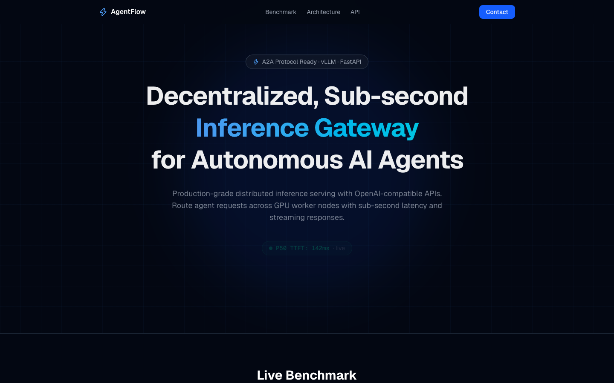
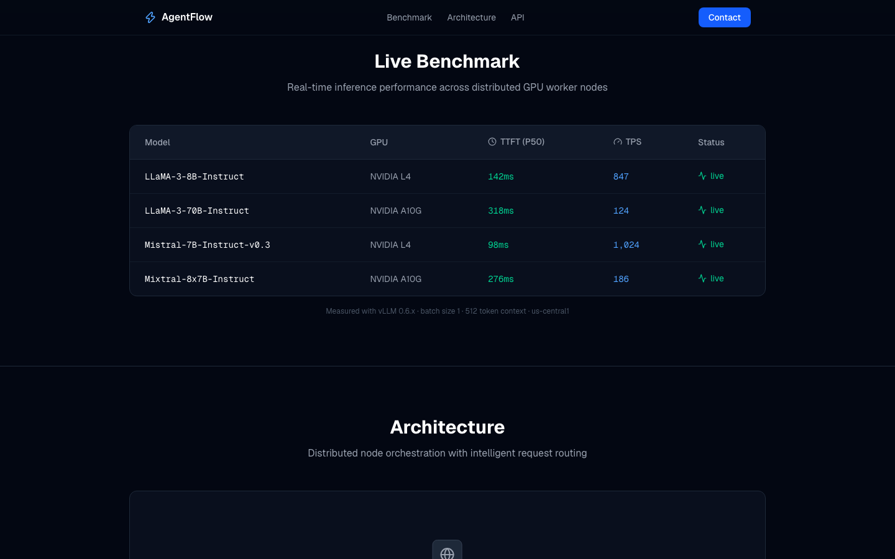

# AgentFlow Engine

**High-throughput, Low-latency Distributed Inference Gateway for Autonomous AI Agents**

[](https://agentflowengine.com)
[](https://api.agentflowengine.com/health)
[]()

OpenAI-compatible API gateway for production agent deployments. Route requests across GPU worker nodes with sub-second latency and streaming responses.

**Live demo:** https://agentflowengine.com · **API health:** https://api.agentflowengine.com/health

---

## Screenshots

| Landing | Beta Target Benchmarks |
|---------|------------------------|
|  |  |

> Regenerate: `npm install playwright && npx playwright install chromium && node scripts/capture-screenshots.js`

---

## Features

- **OpenAI-compatible API** — Drop-in replacement for LangChain, AutoGen, CrewAI
- **Distributed routing** — Latency-aware load balancing across GPU workers
- **Beta API gateway** — Live `/health` and `/v1/chat/completions` (CPU demo mode)
- **A2A Protocol Ready** — Designed for agent-to-agent communication patterns

---

## Architecture

```
Agent Request → Load Balancer/Router → GPU Worker Nodes (L4/A10G/A100) → Streaming Response
```

| Component | Technology |
|-----------|------------|
| Inference | vLLM, PyTorch, CUDA 12.x |
| API Server | Python 3.11, FastAPI |
| Frontend | Next.js 16, TypeScript, Tailwind CSS |
| Deploy | Docker, Railway, GCP/Azure/AWS |

---

## Repository Structure

```
├── landing-page/          # Marketing site (Next.js static)
├── api/                   # Beta FastAPI gateway (CPU demo)
├── infrastructure/
│   ├── scripts/           # Node setup, health monitoring, GPU orchestration
│   └── docker/            # vLLM worker template
├── docs/                  # Internal docs & screenshots
└── README.md
```

---

## Quick Start

### Landing Page (Local)

```bash
cd landing-page
npm install
npm run dev
# → http://localhost:3000
```

### Beta API (Local)

```bash
cd api
pip install -r requirements.txt
uvicorn main:app --reload --port 8080
# → http://localhost:8080/health
```

### GPU Node Setup (Ubuntu 22.04/24.04)

```bash
sudo bash infrastructure/scripts/setup_node.sh
# Verify: docker run --rm --gpus all nvidia/cuda:12.0.0-base-ubuntu22.04 nvidia-smi
```

### Health Monitor (Production)

```bash
pip install -r infrastructure/scripts/requirements.txt
export TELEGRAM_BOT_TOKEN=your_token
export TELEGRAM_CHAT_ID=your_chat_id
python infrastructure/scripts/health_monitor.py
```

### Node Identity (Ed25519 / did:key)

```bash
pip install cryptography
python infrastructure/scripts/generate_did_key.py node_identity.json
```

---

## API Examples

### Health Check

```bash
curl https://api.agentflowengine.com/health
```

### Chat Completions (Beta CPU Gateway)

```bash
curl https://api.agentflowengine.com/v1/chat/completions \
  -H "Content-Type: application/json" \
  -d '{
    "model": "llama-3-8b-instruct",
    "messages": [{"role": "user", "content": "Hello"}]
  }'
```

### List Models

```bash
curl https://api.agentflowengine.com/v1/models
```

---

## Beta Target Benchmarks (Q4 2026 GPU Load Test)

> Estimated targets — not live production metrics.

| Model | GPU | TTFT (P50) | TPS |
|-------|-----|------------|-----|
| LLaMA-3-8B-Instruct | NVIDIA L4 | ~142ms | ~847 |
| LLaMA-3-70B-Instruct | NVIDIA A10G | ~318ms | ~124 |
| Mistral-7B-Instruct | NVIDIA L4 | ~98ms | ~1,024 |

---

## Deployment

| Service | Platform | URL |
|---------|----------|-----|
| Landing | Railway (Docker) | https://agentflowengine.com |
| API | Railway (Docker) | https://api.agentflowengine.com |

---

## Roadmap

- [x] Landing page & OpenAI-compatible API design
- [x] Beta CPU API gateway (`/health`, `/v1/chat/completions`)
- [x] Infrastructure automation scripts
- [ ] Multi-node vLLM router (Q4 2026 cloud GPU beta)
- [ ] Public API launch (Q1 2027)

---

## Contact

- **Website:** https://agentflowengine.com
- **Email:** contact@agentflowengine.com
- **GitHub:** https://github.com/LEEJINSOL1/agentflow-engine

---

## License

MIT
